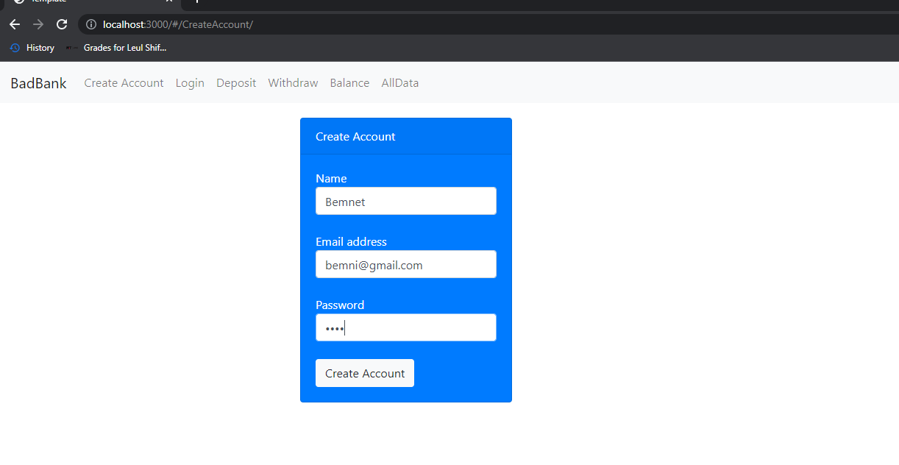
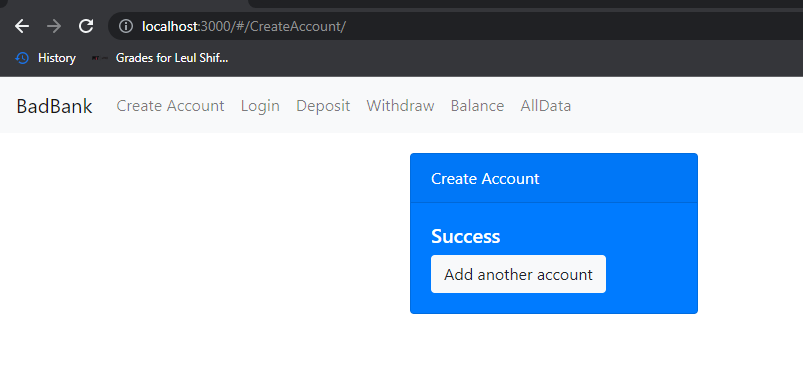
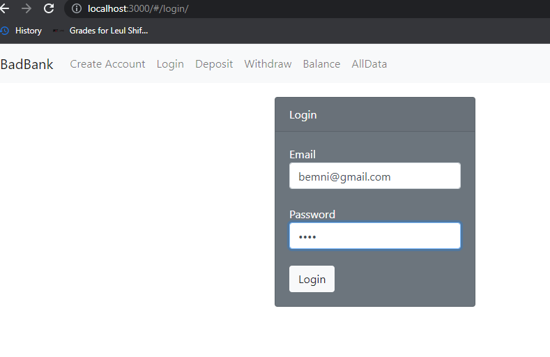
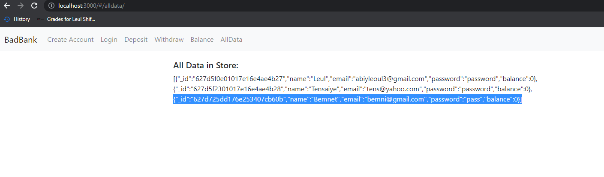

# BadBankReadme

## Description
This project is an example of a banking application. It was named BadBank because it doesn't have good security such as authentication and authorization. It is meant to demonstrate the design decisions and technologies that are going to be used to build a full stack application. 

## Installation
<ul>
    <li>First clone the repo. Run "git clone 'https://github.com/LeulShiferaw/BadBankReadme.git'".
    <li>Make sure to install all dependencies first. You can run 'npm install' in the root folder for that.</li> 
    <li>Then you need to have a mongodb instance running. Run 'docker run -p 27017: 27017 --name anyName -d mongo' for that.</li> 
    <li>Then just run 'node index.js' in the root folder.</li> 
    <li>You can use Studio3T or mongodbCompass to check the entries on you mongodb server.</li>
</ul>

## Screenshots

## Tech Stack
HTML, CSS, React, NodeJS, MongoDB, Express (MERN stack)

## Features
Current Features:
 
<ol>
    <li>Create Account</li>
    <li>Login</li>
    <li>Display All data</li>
</ol>
Future Features:
 
<ol>
    <li>Better UI for display all data</li>
    <li>Authentication and authorization</li>
</ol>

## License
MIT License used.
